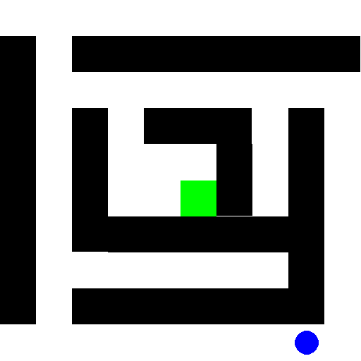

# Gridworld: Tabular Reinforcement Learning in a Custom Maze

This project implements a classic tabular reinforcement learning algorithm in a simple Gridworld environment.

## Overview

This project features a custom-built Gridworld environment using PyGame, where an agent learns to navigate through a maze to reach a target location. The environment is designed to be compatible with tabular reinforcement learning algorithms.

<p align="center">
  
</p>

## Environment Details

- **Grid Size**: 10x10
- **Agent Start Position**: (7, 9)
- **Target Position**: (5, 5)
- **Actions**: Up, Down, Left, Right
- **Rewards**:
  - Reaching the target: +5
  - Each step: -1
- **Walls**: Defined using `pygame.Rect` to create obstacles within the grid

## Getting Started

### Prerequisites

- Python 3.x
- `numpy`
- `pygame`
- `gym`

Install the required packages:

```bash
pip install -r requirements.txt
```
## Running the Environment

To train the agent and visualize its performance:

```bash
python agent.py
```

This will:

- Train the Q-learning agent in the custom maze environment  
- Run a "human-rendered" episode showing the final value policy

## Reinforcement Learning Details

- **Algorithm**: Q-learning  
- **Exploration Strategy**: Epsilon-greedy with decaying epsilon  
- **Learning Rate**: Configurable  
- **Discount Factor**: Configurable  

The agent updates its Q-table based on the rewards received from the environment, learning the optimal path to the target over time.
<p align="center">
  
</p>
